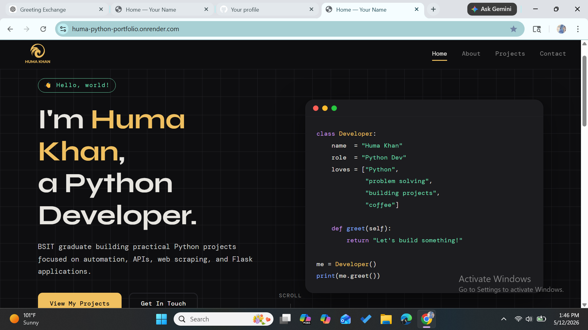
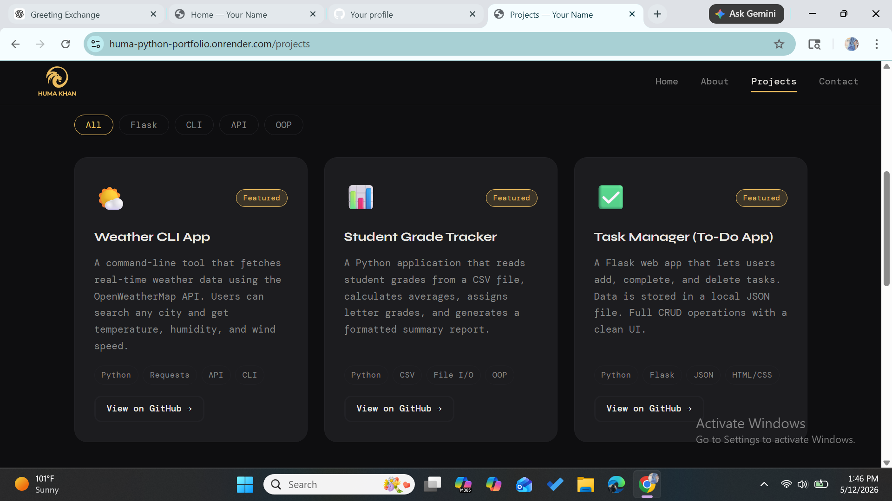
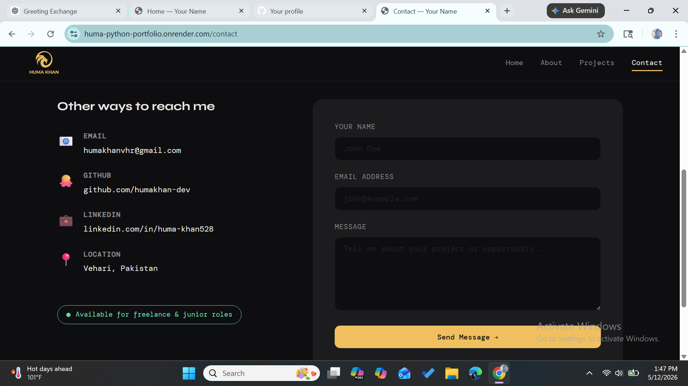

# 🐍 Huma Khan — Python Portfolio Website

A modern developer portfolio website built using **Python, Flask, HTML, CSS, and JavaScript**.

This portfolio showcases my Python projects, Flask development skills, web applications, and frontend design in a clean and responsive interface.

---

## 🌐 Live Demo

🔗 https://huma-python-portfolio.onrender.com/

---

## ✨ Features

- Responsive modern UI
- Flask backend integration
- Home, About, Projects, and Contact pages
- Project showcase section
- Mobile-friendly layout
- Clean developer-style interface
- GitHub project integration

---

## 🛠️ Tech Stack

- Python
- Flask
- HTML5
- CSS3
- JavaScript
- Jinja2 Templates
- Render Deployment
- Git & GitHub

---

## 📁 Folder Structure

```
portfolio/
│
├── app.py                  # Main Flask app — routes & project data
├── requirements.txt        # Python packages needed
├── Procfile                # Tells Render how to run the app
├── render.yaml             # Render deployment config
├── .gitignore              # Files Git should ignore
│
├── templates/              # HTML pages (Jinja2 templates)
│   ├── base.html           # Shared layout (navbar, footer)
│   ├── home.html           # Home page
│   ├── about.html          # About Me page
│   ├── projects.html       # Projects page
│   └── contact.html        # Contact form
│
└── static/                 # Files sent directly to the browser
    ├── css/
    │   └── style.css       # All styling
    └── js/
        └── main.js         # Mobile nav + project filter
```

---

---

## 📸 Screenshots

### Home Page


### Projects Section


### Contact Page


## 🚀 Run Locally (VS Code)

### Step 1 — Install Python
Download from https://python.org (version 3.10+). Confirm with:
```bash
python --version
```

### Step 2 — Open project in VS Code
```bash
cd portfolio
code .
```

### Step 3 — Create a virtual environment
```bash
# Windows
python -m venv venv
venv\Scripts\activate

# Mac / Linux
python3 -m venv venv
source venv/bin/activate
```
Your terminal prompt will show `(venv)` when activated.

### Step 4 — Install Flask
```bash
pip install -r requirements.txt
```

### Step 5 — Run the app
```bash
python app.py
```
Open your browser and go to: **http://127.0.0.1:5000**

---

## 📦 Push to GitHub

```bash
git init
git add .
git commit -m "Initial portfolio commit"
git branch -M main
git remote add origin https://github.com/YOUR_USERNAME/portfolio.git
git push -u origin main
```

---

## ☁️ Deployment

1. Go to https://render.com and sign up (free)
2. Click **New → Web Service**
3. Connect your GitHub account and select this repository
4. Render auto-detects your settings from `render.yaml`
5. Click **Deploy** — your site is live in ~3 minutes!
6. Your URL will be: `https://my-portfolio.onrender.com`

> ⚠️ Free tier sleeps after 15 min of inactivity — first load is slow.

---

## ✏️ How to Customize

| What to change | Where |
|---|---|
| Your name & bio | `app.py` → hero text, `templates/home.html`, `templates/about.html` |
| Your projects | `app.py` → `PROJECTS` list |
| Your skills | `app.py` → `SKILLS` dict |
| Colors & fonts | `static/css/style.css` → `:root` variables |
| Social links | `templates/base.html` → footer |
| Contact email | `templates/contact.html` |

---

## 📚 What Each File Does

- **app.py** — The brain. Starts the server and sends the right HTML for each URL.
- **templates/base.html** — The shared frame (navbar + footer) every page uses.
- **templates/home.html** — Your landing page with hero text and featured projects.
- **templates/about.html** — Your story, education, skills, and learning path.
- **templates/projects.html** — All your projects with filter buttons.
- **templates/contact.html** — A form visitors can use to message you.
- **static/css/style.css** — Every colour, font, and layout rule.
- **static/js/main.js** — Mobile menu toggle and project filter logic.
- **requirements.txt** — The list of packages `pip` needs to install.
- **Procfile** — Tells Render to use `gunicorn` (production server) instead of Flask's dev server.
- **.gitignore** — Tells Git which files to skip (venv, secrets, etc).
